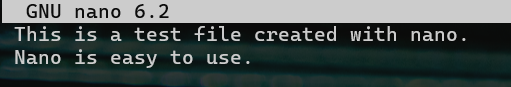
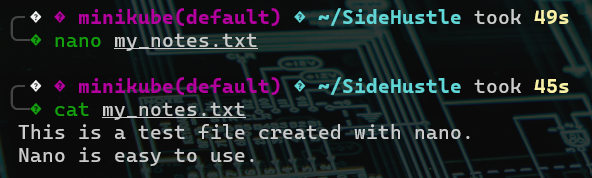
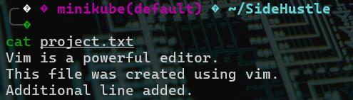

# Linux Text Editor Task – Corrected Submission

## Introduction

This README outlines using the Linux Text Editor:

- Using **Linux-based text editors** such as `vim` and `nano`
- Creating, editing, and managing files using these editors
- Understanding use cases, functionality, and navigation within both editors

All actions were performed using **Ubuntu 22.04 LTS**.

---

## Tools Used

- **Operating System**: Ubuntu 22.04 LTS (VirtualBox)
- **Text Editors**: Vim, Nano (both installed by default)
- **Terminal Access**: Ubuntu Terminal (Bash)

---

## Task Steps

### Step 1: Create and Edit a File Using `nano`

```bash
nano my_notes.txt
```

- Entered some text:
  ```
  This is a test file created with nano.
  Nano is easy to use.
  ```

- Saved with `CTRL + O`, then exited with `CTRL + X`.



---

### Step 2: View Content of the File

```bash
cat my_notes.txt
```

- Output:
  ```
  This is a test file created with nano.
  Nano is easy to use.
  ```



---

### Step 3: Create and Edit a File Using `vim`

```bash
vim project.txt
```

- Pressed `i` to enter INSERT mode
- Typed:
  ```
  Vim is a powerful editor.
  This file was created using vim.
  ```

- Pressed `ESC`, typed `:wq` to save and quit.


---

### Step 4: Reopen and Edit `project.txt` with Vim

```bash
vim project.txt
```

- Appended new content in INSERT mode:
  ```
  Additional line added.
  ```

- Saved and exited again with `:wq`


---

### Step 5: Compare Both Files

```bash
cat my_notes.txt
cat project.txt
```

- Confirmed both files contain appropriate content and were successfully created/edited using CLI editors.



---

## Comparison: Vim vs Nano

| Feature          | Nano                          | Vim                           |
|------------------|-------------------------------|-------------------------------|
| Learning Curve   | Beginner-friendly             | Steeper, powerful             |
| Editing Mode     | Direct                        | Requires INSERT mode          |
| Shortcuts        | `CTRL + O`, `CTRL + X`        | `:w`, `:q`, `i`, `ESC`        |
| Use Case         | Quick edits                   | Advanced editing, scripting   |

---
