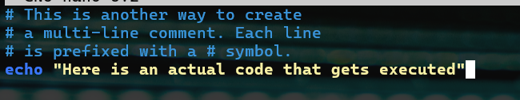
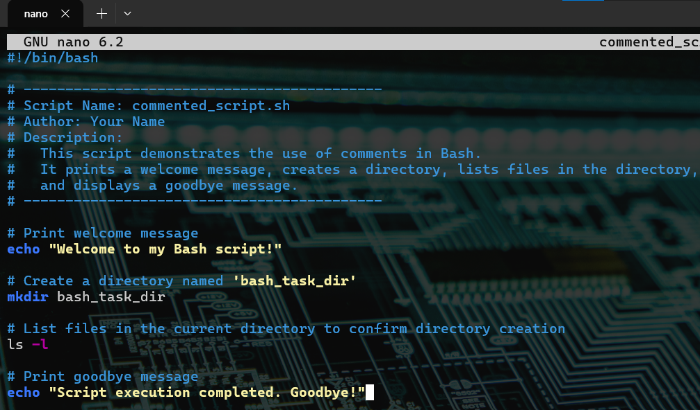
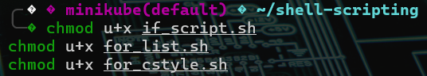

#  Adding Comments in Bash Scripts

## Overview

In this task, we explored how to add comments to Bash scripts. Comments are essential for writing maintainable, understandable code and serve as notes to yourself and other developers. They help describe what the code does and why it does it, without affecting how the code runs. The task demonstrates the use of comments in Bash scripts while also fulfilling functional requirements. It includes:

- Use of single-line and multi-line comments
- A shebang line at the top of the script
- Functional Bash commands: printing a welcome message, creating a directory, listing contents, and printing a goodbye message
- Instructions on script execution with correct permissions

---

## What Are Comments?

Comments are lines in your code that are ignored by the interpreter. In Bash scripts, they help document the script’s purpose and logic, improving collaboration and self-maintenance.

---

## Single-Line Comments

Single-line comments start with the `#` symbol. Everything after this symbol on a line is considered a comment.

```bash
# This is a single-line comment in Bash
echo "Hello, you are learning Bash Scripting on DAREY.IO!" # This is also a comment, following a command
```


---

## Using Multiple Single-Line Comments

Instead of a block comment, Bash uses multiple single-line comments:

```bash
# This is another way to create
# a multi-line comment. Each line
# is prefixed with a # symbol.
echo "Here is an actual code that gets executed"
```



---

## Script: `commented_script.sh`

```bash
#!/bin/bash

# -------------------------------------------
# Script Name: commented_script.sh
# Author: Your Name
# Description:
#   This script demonstrates the use of comments in Bash.
#   It prints a welcome message, creates a directory, lists files in the directory,
#   and displays a goodbye message.
# -------------------------------------------

# Print welcome message
echo "Welcome to my Bash script!"

# Create a directory named 'bash_task_dir'
mkdir bash_task_dir

# List files in the current directory to confirm directory creation
ls -l

# Print goodbye message
echo "Script execution completed. Goodbye!"
```



---

## Script Execution Steps

1. **Make the script executable**

```bash
chmod u+x commented_script.sh
```



2. **Run the script**

```bash
./commented_script.sh
```


---

## Features Demonstrated

- Shebang line: `#!/bin/bash`
- Single-line and multi-line comments
- Printing messages using `echo`
- Directory creation with `mkdir`
- File listing with `ls -l`
- Execution instructions (`chmod`, `./`)

---

## Best Practices for Commenting

Here are some best practices followed in this task:

- **Clarity**: Explained the _why_ behind a piece of code, not just the _what_.
- **Maintainability**: Wrote comments that remain useful and easy to update as the script changes.
- **Usefulness**: Focused on commenting complex or non-obvious parts of the code.
- **Avoided Overcommenting**: Only commented where necessary, avoiding redundancy.

---

## Summary

This task laid a solid foundation for writing professional Bash scripts using comments effectively. We learned how to:

- Write single-line and multi-line comments using `#`
- Embed comments inline with commands
- Follow commenting best practices

This understanding will be essential in the upcoming capstone project where these skills will be applied in full Bash scripting use cases.

---

> Commenting is not just a good habit—it's a critical part of writing clean and maintainable scripts.
