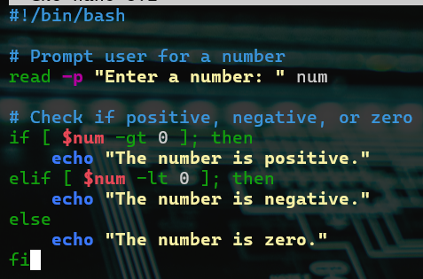
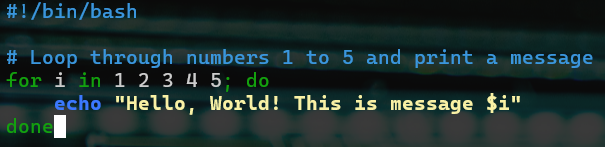
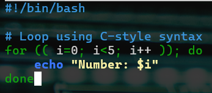

# Control Flow in Bash Shell Scripting

## Objective

This project explores the use of **control flow statements** in Bash scripting, particularly focusing on:

- `if`, `elif`, `else` statements
- `for` loops (list form and C-style form)

These concepts are essential for decision-making and automation in shell scripts.

---

## What is Control Flow?

Control flow determines the order in which statements are executed in a script. It lets the script:

- Make decisions based on conditions (`if-else`)
- Repeat actions (`for` loops)

---

## Task Overview

Required to:

1. Create a script demonstrating the use of `if`, `elif`, and `else`.
2. Create a script using:
   - List-style `for` loop
   - C-style `for` loop
3. Add each script to a separate `.sh` file.
4. Set the correct permissions using `chmod`.
5. Execute each script and evaluate its output.

---

## Script 1: if-elif-else Statement

Filename: `if_script.sh`

```bash
#!/bin/bash

# Prompt user for a number
read -p "Enter a number: " num

# Check if positive, negative, or zero
if [ $num -gt 0 ]; then
    echo "The number is positive."
elif [ $num -lt 0 ]; then
    echo "The number is negative."
else
    echo "The number is zero."
fi
```



---

## Script 2: List-style For Loop

Filename: `for_list.sh`

```bash
#!/bin/bash

# Loop through numbers 1 to 5 and print a message
for i in 1 2 3 4 5; do
    echo "Hello, World! This is message $i"
done
```



---

## Script 3: C-style For Loop

Filename: `for_cstyle.sh`

```bash
#!/bin/bash

# Loop using C-style syntax
for (( i=0; i<5; i++ )); do
    echo "Number: $i"
done
```



---

## Setting Permissions and Running Scripts

Make each script executable:

```bash
chmod u+x if_script.sh
chmod u+x for_list.sh
chmod u+x for_cstyle.sh
```


Run each script:

```bash
./if_script.sh
./for_list.sh
./for_cstyle.sh
```


---

## Key Takeaways

- `if`, `elif`, and `else` provide conditional logic
- `for` loops automate repetitive actions
- `-gt`, `-lt`, and other operators are used for numeric comparisons
- Scripts must be given execute permission using `chmod`

---

## Summary

This task solidifies your understanding of **control flow** in Bash scripts. By creating and executing scripts with conditionals and loops, you’ve practiced one of the core building blocks of automation and scripting.
