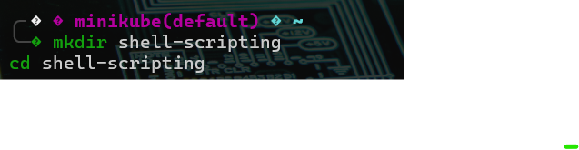
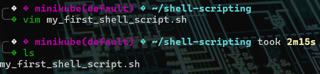
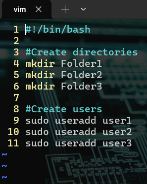
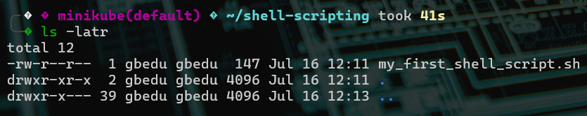
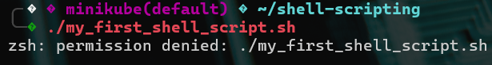
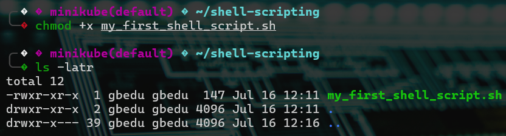
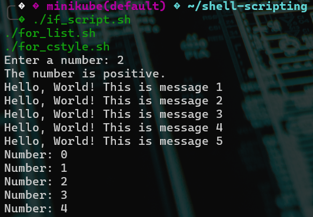
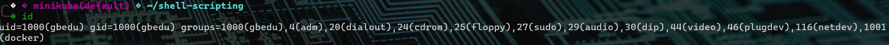
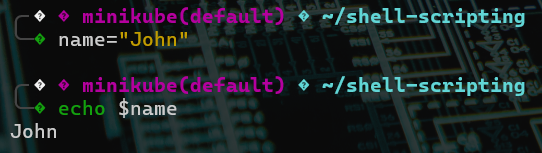

# Shell Scripting Project: Automating Directory and User Creation

## Overview

This project focuses on writing a shell script to automate system administrative tasks such as:

- Creating directories
- Creating user accounts
- Managing file permissions
- Executing scripts
- Understanding the shebang (`#!/bin/bash`)
- Declaring and using variables in bash

---

## 🛠 Tools & Environment
- **Operating System**: Ubuntu (via VirtualBox or EC2 instance)
- **Shell**: Bash (`/bin/bash`)
- **Text Editor**: `vim`
- **User Access**: Root privileges (`sudo`)
- **Terminal Commands**: `mkdir`, `vim`, `chmod`, `ls`, `id`, `echo`

---

## Steps Followed

### 1. Create a Working Directory

Created a folder on the Ubuntu system named `shell-scripting`:

```bash
mkdir shell-scripting
cd shell-scripting
```



---

### 2. Create the Shell Script File with `vim`

Launched the `vim` text editor and created a new file named `my_first_shell_script.sh`:

```bash
vim my_first_shell_script.sh
```



---

### 3. Write the Shell Script

Inside the `vim` editor, the following script was written:

```bash
#!/bin/bash

# Create directories
mkdir Folder1
mkdir Folder2
mkdir Folder3

# Create users
sudo useradd user1
sudo useradd user2
sudo useradd user3
```



---

### 4. Save and Exit the Editor

Saved the file using `:wq`.

---

### 5. Verify Script Creation and File Permissions

Checked the contents of the directory and verified the script exists with:

```bash
ls -latr
```

output:
```
-rw-r--r--  1 gbedu gbedu  147 Jul 16 12:11 my_first_shell_script.sh
```

This output indicates:
- The file is owned by `gbedu`
- The owner has **read** and **write** permissions
- No one has **execute** permission yet



---

### 6. Attempted to Run the Script (Permission Denied)

Tried to run the script:

```bash
./my_first_shell_script.sh
```

Received this error:
```
bash: ./my_first_shell_script.sh: Permission denied
```



---

### 7. Grant Execute Permission with `chmod`

Added execute permission to the owner:

```bash
chmod +x my_first_shell_script.sh
```

Now the file is executable.



---

### 8. Successfully Executed the Script

Executed the script:

```bash
./my_first_shell_script.sh
```



---

### 9. Validated Folder Creation

Used the `ls` command to confirm the folders were created:

```bash
ls -l
```

Folders:
- Folder1
- Folder2
- Folder3


---

### 10. Validated User Creation

Used the `id` command to verify the users were created:

```bash
id user1
id user2
id user3
```

output:


---


### Understanding the Shebang

The script starts with:

```bash
#!/bin/bash
```

This line is called a **shebang**, which tells the operating system to use Bash to interpret the script.

If omitted, the system might not know how to run the script properly.

---

### Variables in Bash

#### Declare a Variable

```bash
name="John"
```

#### Print the Variable

```bash
echo $name
```

Expected output:
```
John
```



---

## Conclusion

This project successfully demonstrated:

- Writing a bash shell script to automate system tasks
- Creating directories and Linux users
- Understanding and modifying file permissions using `chmod`
- Executing shell scripts from the terminal
- Using `vim` to edit files
- Declaring and using variables
- Interpreting the purpose of the shebang (`#!/bin/bash`)

All requirements from the task were addressed and met, with relevant screenshots and explanations included.
