# DevOps Environment Setup – Complete Submission

This project documents the complete setup of a basic DevOps learning environment, including local development tools and a cloud-based Ubuntu server. It covers:

- Installing essential tools (VS Code, Git, VirtualBox)
- Setting up Ubuntu locally via VirtualBox
- Creating and connecting to an AWS EC2 Linux instance (Ubuntu)
- Managing packages on Linux using `apt`
- Documenting Linux distributions and their role in DevOps

---

## Understanding Linux and Its Distributions

Linux is a family of open-source operating systems widely used in DevOps, cloud computing, and server management. Linux distributions (distros) provide different tools and package managers built on the same kernel.

### Common Distributions:
- **Ubuntu** – User-friendly, popular in cloud and development
- **CentOS** – Known for enterprise-grade stability (discontinued in favor of Rocky Linux)
- **Debian** – Foundation for Ubuntu, stable and secure
- **Fedora** – Cutting-edge features, often used for testing new technologies

Here is an ubuntu distro:

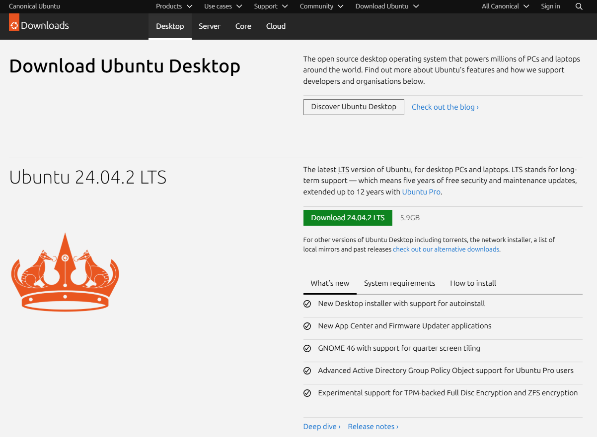

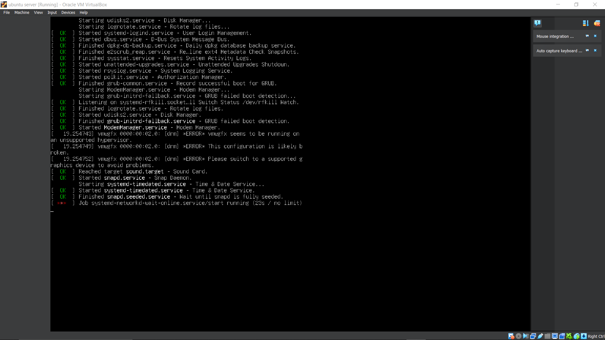

---

## Installing Tools Locally

### Visual Studio Code

Installed as the primary text editor for development.

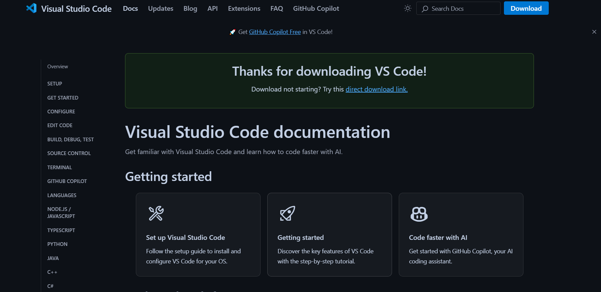

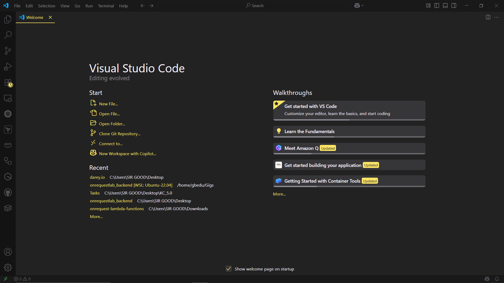

---

### Git

Installed to manage source control and interact with GitHub repositories.

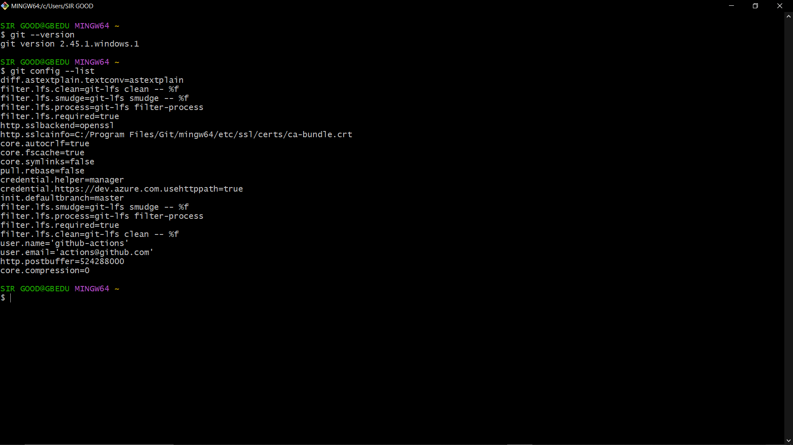

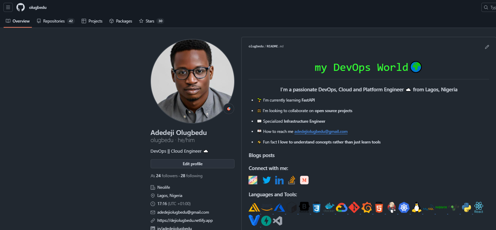

---

### VirtualBox

Used to create and manage virtual machines on the local system.


---

### Ubuntu Installation on VirtualBox

Ubuntu was installed as a guest OS on VirtualBox to practice Linux-based development locally.


---

## Creating and Connecting to a Cloud-Based Linux Server

### AWS Account Creation

An AWS account was created at [https://aws.amazon.com](https://aws.amazon.com) to provision cloud infrastructure.

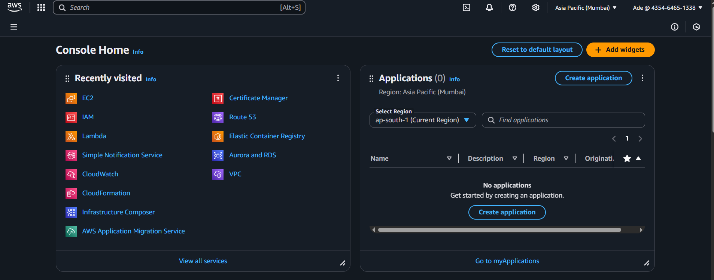

---

### Provisioning Ubuntu EC2 Instance

Steps taken:
1. Launched an **Ubuntu 22.04 EC2 instance**
2. Selected t2.medium
3. Created a **key pair** for SSH access
4. Configured security group (port 22 open)

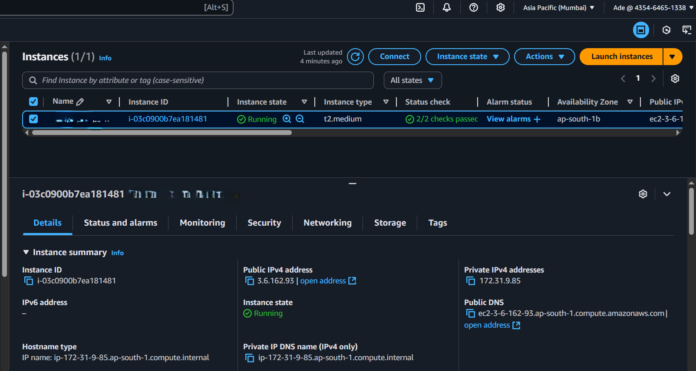

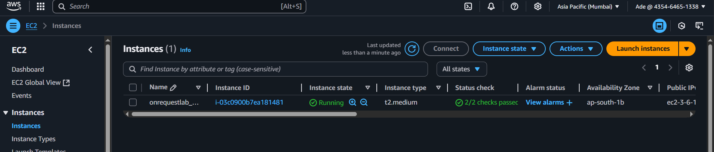

---

### Connecting via SSH

Connected to the EC2 instance using SSH:

```bash
ssh -i "my-key.pem" ubuntu@<ec2-public-ip>
```
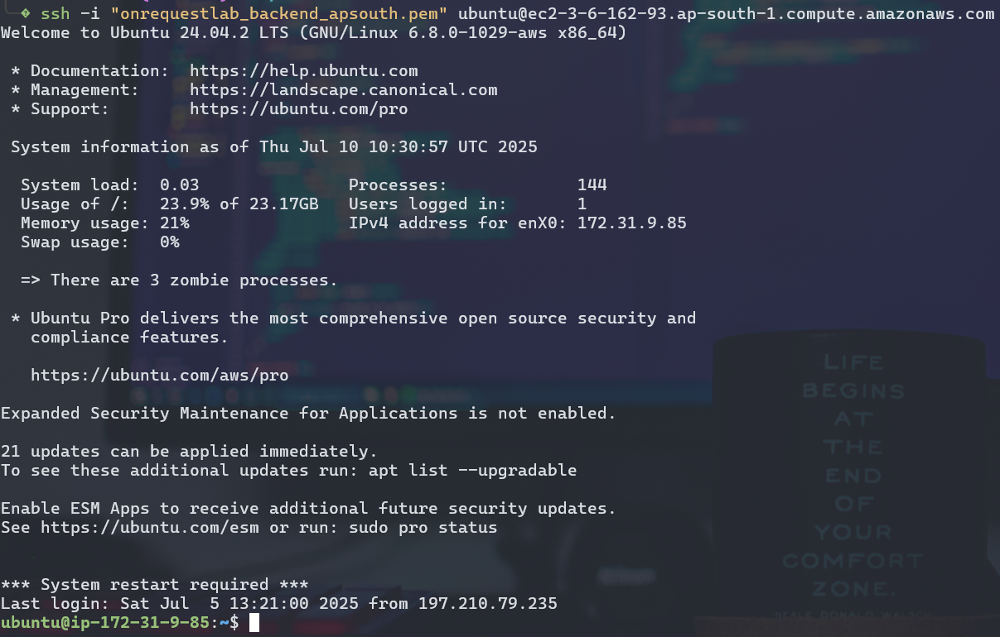

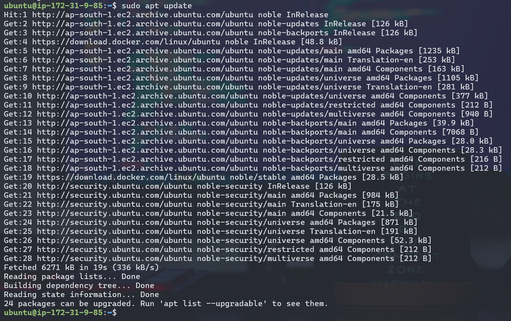
